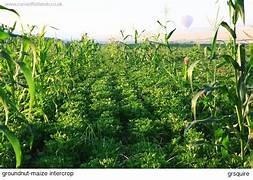
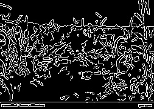
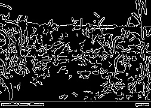

# 🌾 AgriVision – MPI Disease Detection

A high-performance crop disease detection system using MPI and OpenCV with parallel processing.

---

## 🚀 Features
- Parallel image processing using MPI
- Disease detection based on color analysis
- Performance comparison (Serial vs Parallel)
- Works on multiple processors

---

## 📸 Input Image

---

## 📸 Output Image

---

## 🔍 Serial vs Parallel Output

### 🖥️ Serial Output

### ⚡ Parallel Output

## 📊 Execution Result

Serial Time: 0.0109  
Parallel Time: 0.0012  
Speedup: 8.46  

Detected Disease: Fungal Infection

---

## ⚙️ How to Run
cd C:\MPI\src
mpiexec -n 4 python image_test.py

---

## 🧠 Technologies Used
- Python
- MPI (mpi4py)
- OpenCV
- NumPy

---

## 🎯 Conclusion
Parallel processing significantly improves execution speed for crop disease detection.

---

## 🔮 Future Work
- Use AI/ML for accurate classification
- Real-time detection using mobile camera
- Multi-crop disease identification
